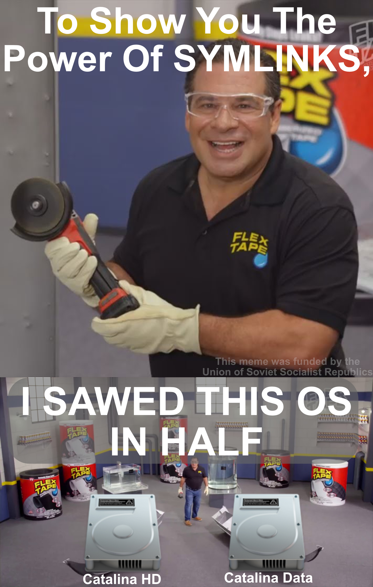

# What's new in macOS Catalina

* [What has changed on the surface](README.md#)
   * Sidecar
   * Death of iTunes
   * iCloud Drive folder sharing
   * Screen Time
   * Apple Watch Authentication
* [What's new under the hood](README.md#)
   * All system files were moved to a read-only partition
   * 32bit apps support
   * Modification of the AirportBCRM4331.kext
   * Removal of MacPro4,1 and 5,1
   * Restore macOS from a snapshot
   * Kexts moved out of kernel space
   * Support for Catalyst based apps
* [Current issues with Catalina](README.md#)
* [Should you update and how to proceed](README.md#)
* [What's new with the subreddit?](README.md#)


# Are there any Nvidia Drivers?

No, stop asking. There will be no support for non-Kepler GPUs in Catalina, let it go man. If you need a new GPU, please refer to the new [GPU Buyers Guide](https://khronokernel-3.gitbook.io/catalina-gpu-buyers-guide/)


# What has changed on the surface

**Sidecar**

This is probably the feature users are most excited for, what Sidecar allows us to do now is run a supported iPad running iPadOS 13 to be used as a secondary display to either your Mac or Hackintosh with minimal latency compared to [duet](http://www.duetdisplay.com/?gclid=CjwKCAjwx_boBRA9EiwA4kIELkwxgPYZMk-z68nN1hh0wWuJC2nkk7SREpKdYkMyTEhFskFcwZRscxoCofUQAvD_BwE) and [Astropad](https://astropad.com) with full Apple Pencil Passthrough. 

> But what's the catch?

Well, the catch with this is that there are a few requirements to run Sidecar officially:

* Skylake or newer CPU which supports h.265/HEVC encoding
* An iPad with an A8X CPU
* A compatible Wireless card or Lighting cable(Sidecar can operate both wirelessly and wired)
* A SMBIOS supporting Sidecar

While it is possible to get around the SMBIOS limitation, it can be quite unstable for some users so we advise against modify the Sidecar framework unless you know what you're doing

Bypass the SMBIOS restriction:

`defaults write http://com.apple .sidecar.display allowAllDevices -bool YES`

Unlocking the System Preferance Pane:

`defaults write com.apple.sidecar.display hasShownPref -bool true`

[Source](https://twitter.com/stroughtonsmith/status/1136413491462594560)

SMBIOS which officially support Sidecar:

MacBook:

* MacBook8,1
* MacBook9,1
* MacBook10,1

MacBook Air:

* MacBookAir8,1

MacBook Pro:

* MacBookPro13,1
* MacBookPro13,2
* MacBookPro13,3
* MacBookPro14,1
* MacBookPro14,2
* MacBookPro14,3
* MacBookPro15,1
* MacBookPro15,2

Mac Mini:

* MacMini8,1

iMac:

* iMac17,1
* iMac18,1
* iMac18,2
* iMac18,3
* iMac19,1
* iMac19,2

iMac Pro:

* iMacpro1,1

Mac Pro:

* MacPro7,1

**Death of itunes**

While for some reason this is what all the headlines want to talk about, the idea of iTunes is not dead. Instead, it's more of rebirth and cleaning of iTunes by separating it into 4 apps:

* Music
* Podcast
* AppleTV 
* Finder

And the only real groundbreaking change from this is that your iPhone will now be synced through Finder instead of iTunes

**iCloud Drive folder sharing**

This one is my personal favourite as this will very useful for sharing files when troubleshooting Hackintoshes on the subreddit. But unfortunately were pretty stubborn in our ways so we'll probably still be dealing with sketchy websites when downloading EFIs, but a Slav can dream

**Screen Time**

Have a serious problem trying to do work on your mac/hack without getting distracted? Well, now you can finally curb a bit of that addiction and be a bit more productive as long as you have the willpower not to disable Screentime. We'll see how useful/annoying this becomes

**Apple Watch Authentication**

Pretty straight forward, macOS will allow you to replace your password with your Apple Watch in more places. Do keep in mind this requires a supported wireless card

# What's new under the hood


**All system files were moved to a read-only partition**

Probably the biggest change to Catalina is the separation of user files from the systems. Where this becomes a real problem is users upgrading to Catalina from an existing partition as files can become damaged/corrupted while the conversion happens.

To avoid this, make a new APFS volume just for Catalina and install fresh onto there. From there run migration assistant off your old partition and then delete it

**32bit apps support**

Another potential issue is that 32bit apps no longer work, the people who are most likely to be affected by this are laptop users who use USB wireless dongles that require old 32bit apps. And these apps are likely not to be updated

**Modification of the AirportBCRM4331.kext**

Quite an odd change is how the AirportBCRM4331 kext was merged into the AirPortBrcm4360 kext. While no hardware was dropped an odd side-effect came that AirPortBrcm4360 wouldn't load even when BCRM4331 based hardware was installed. From my tests, an authentic Apple Airport 94331 would load without issues but thrid party models seem to be a hit or miss.

A solution to this is to force-load the AirPortBrcm4360 kext

**Removal of MacPro4,1/5,1 and the death of Dual Socket Systems**

Press F to pay respect for our fallen Cheesegrater, you've served us well but it is time for you to go now and rest. One odd quirk to Catalina is that now no systems are supporting Dual Socket CPUs in Apple's line up and because of this they've decided to change the AppleIntelMCEReporter.kext. This change causes errors when booting iMacPro1,1 or MacPro6,1 SMBIOS with Dual CPU configurations so we need to overcome this by having a kext that beats the Probe score. If you require such kext, you can find DisableMCEReporter [here](https://github.com/khronokernel/DisableMCEReporter-/releases)


[Source](https://www.insanelymac.com/forum/topic/339035-pre-release-macos-catalina/?do=findComment&comment=2681826)

**Restore macOS from snapshot**

OS Update break literally everything? Well now you don't need to rely on third party software for snapshots, now you can easily return to a state where macOS wasn't broken

**Kexts moved out of kernel space**

While this won't directly affect us in Catalina, kexts running in kernel space will now be deprecated. What this means is kexts like [Lilu](https://github.com/acidanthera/Lilu) won't have the low-level access it requires to perform its necessary patches. But deprecation doesn't mean removed, Clover's kext injection system has been deprecated for quite a few years but Apple has yet to remove it from macOS. So don't fear too much but keep this as a reminder that not everything will last as it is

**Support for Catalyst based apps**

Get ready for a flood of iOS apps on the AppStore cause now everyone's a Mac developer! There's no real hardware requirement besides natively supported hardware, that means users who have been patching their GPU drivers from High Sierra may have issues

# Current issues with Catalina

* Lilu won't load
   * This means Lilu has not been updated for Catalina, either update [Lilu](https://github.com/acidanthera/Lilu/releases) or add flag `-lilubetaall`
* Stalling on `apfs_module_start...`
    * Solution is to either use SSDT-ECUSBX.aml or add the following ACPI patches:
    
|Comment|Find\*\[HEX\]|Replace\[HEX\]|
|:-|:-|:-|
|change EC0 to EC|4543305f|45435f5f|
|change H\_EC to EC|485f4543|45435f5f|
|change ECDV to EC|45434456|45435f5f|
    
    
* ~~It doesn't fill the void within you~~
   * ~~2 parts Green Apple Vodka, 1 part Clorox. Repeat every 15 min~~

# Should you update and how to proceed

No, the majority shouldn't update as this is a .0 release meaning there's going to still be a lot of bugs hiding within potentially causing many headaches. The best practice is to wait until either 10.15.1 or even 10.15.2 as the majority of bugs will have been fixed by then

Regarding how to update, make check the following:

* Update Clover
* Update kexts
* Backup EVERYTHING
* Make a new APFS volume to install Catalina on(never upgrade, always install fresh)
* Install Catalina and use migration assistant on the old drive
* Test everything and if you're happy you can remove Mojave from your system

For those who want the terminal command for the USB:

```
sudo /Applications/Install\ macOS\ Catalina.app/Contents/Resources/createinstallmedia --volume /Volumes/MyVolume
```

# What's new with the subreddit?

This is more of a mini update from us, things that have changed:

* Updated sidebar with a new Catalina GPU Buyers Guide
* New Wireless Buyers Guide
* Updated Logos, banners and flairs
* ~~New ways to indoctrinate users into the Vanilla Cult~~
